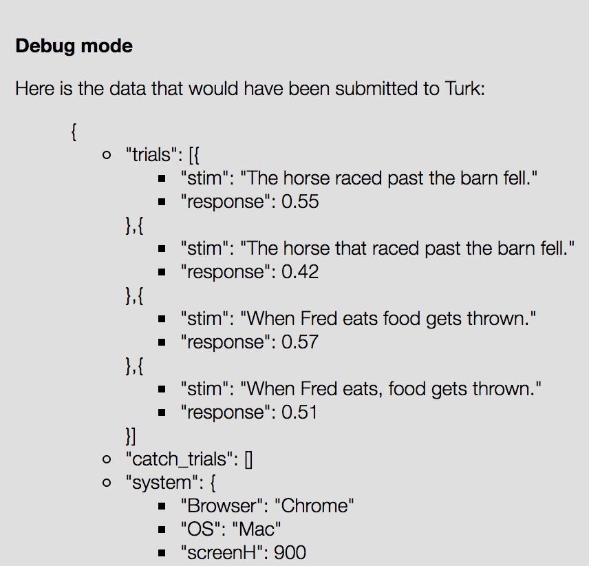
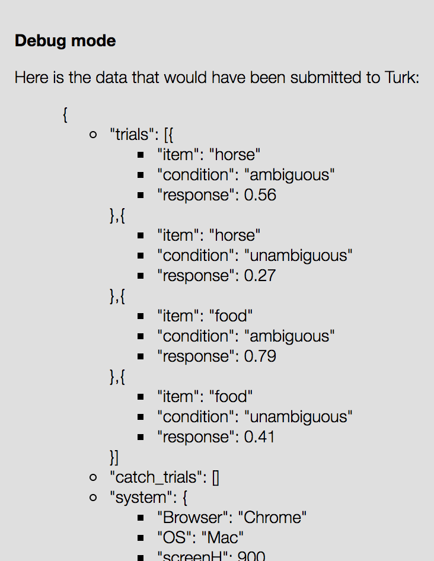
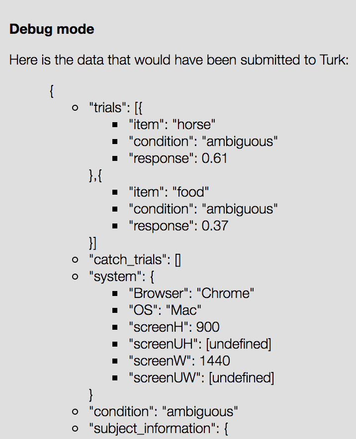

# Template Tutorial - Naturalness Ratings

### Making small changes in the template

In this tutorial we will:

* add stimuli  
* change how results are saved  
* randomize the order of stimuli  
* change the slider with radio buttons  

Other things you can do for practice 

* make it a between subjects experiment
* get text input from participants

**IMPORTANT:** Reload the experiment everytime you make a change and always have Javascript console (⌘⌥J) open.  

Now open index.js in your favourite text editor and follow these steps..


**1. How do we add more stimuli?**

This is where we create stimuli (in the js file):  

```
exp.stims =  [
	{sentence: "The horse raced past the barn fell."}
  ];
```
    
 You can add more stimuli like this:     
  
```
exp.stims =  [
	{sentence: "The horse raced past the barn fell."},
	{sentence: "The horse that raced past the barn fell."},
  ];
```
Don't forget to test!
  
**2. How do we change the way we save results?**

This is how responses are saved: 

```
log_responses : function() {
	exp.data_trials.push({
		"stim" : this.stim.sentence,
		"response" : exp.sliderPost
});
```
If you add even more stimuli 

```
exp.stims =  [    
	{sentence: "The horse raced past the barn fell."},
	{sentence: "The horse that raced past the barn fell."},
	{sentence: "When Fred eats food gets thrown."},
	{sentence: "When Fred eats, food gets thrown."}  
];
```
results will look like this.



This is not an efficient way of saving results. We essentially have two items and each item appers in two conditions: ambiguous and unambiguous. Saving this information will make your job much easier when analyzing your data. You can include this information in the following way:

```
exp.stims =  [    
	{item: "horse", condition: "ambiguous", sentence: "The horse raced past the barn fell."},
	{item: "horse", condition: "unambiguous", sentence: "The horse that raced past the barn fell."},
	{item: "food", condition: "ambiguous", sentence: "When Fred eats food gets thrown."},
	{item: "food", condition: "unambiguous", sentence: "When Fred eats, food gets thrown."}
] 
```
Now you want to make sure that this information is saved together with each response you get.

```
log_responses : function() {
	exp.data_trials.push({
		"item" : this.stim.item,
		"condition": this.stim.condition,
		"stim" : this.stim.sentence,
		"response" : exp.sliderPost
}); 
```
So that results look like this.



**3. How do we randomize the order of stimuli?**

We can randomize the order of stimuli using the built in _.shuffle function.  
Save stimuli as `items` and save its shuffled version as`exp.stims`.

```
var items = [
     {item: "horse", condition: "ambiguous", sentence: "The horse raced past the barn fell."},
     {item: "horse", condition: "unambiguous", sentence: "The horse that was raced past the barn fell."},
     {item: "food", condition: "ambiguous", sentence: "When Fred eats food gets thrown."},
     {item: "food", condition: "unambiguous", sentence: "When Fred eats, food gets thrown."},
    ];

exp.stims =  _.shuffle(items);
```

**NOTE:** 
`present` and `present_handle` are important!  
`present: exp.stims,` ---> Every element of `exp.stims` is passed to `present_handle` one by one so when you add an element to `exp.stims` you add a trial to the experiment.


**4. How do we change the slider with radio buttons (binary choice)?**

In the html file: 
We add the radio buttons:

```
<label><input type="radio"  name="natural" value="No"/>No</label>
<label><input type="radio"  name="natural" value="Yes"/>Yes</label>
```
and comment out/delete the slider:

```
<!-- <table id="slider_table" class="slider_table">
 	<tr><td class="left">unnatural</td><td class="right">natural</td></tr>
	<tr><td colspan="2"><div id="single_slider" class="slider"></div></td></tr>
</table> -->
```
we also want to change the instruction and the error message:

```
<p>Is this sentence natural?</p>
<div class="err">Please make a selection before continuing.</div>
```

In js:
We change `exp.sliderPost` to `exp.response` and uncheck it (like we set it to null when it was a slider).

```
present_handle : function(stim) {
      $(".err").hide();
    
      this.stim = stim;
      $(".prompt").html(stim.sentence);
      $('input[name="natural"]').prop("checked", false);
      
      // this.init_sliders();
      // exp.sliderPost = null;
    },
```
We also change the button function. When the continue button is clicked we want exp.response to get the value of the checked radio button. (Don't forget that the response is now saved in `exp.response`)

```
button : function() {
      exp.response = $('input[name="natural"]:checked').val();
      if (exp.response == null) {
       	$(".err").show();
      } else {
      		this.log_responses();
      	_stream.apply(this);
      }
 },
```
And finally we change how responses get saved.

```
log_responses : function() {
      exp.data_trials.push({
        "item": this.stim.item,
        "condition": this.stim.condition,
        "stim" : this.stim.sentence,
        "response" : exp.response
    });
```    


***Additional: How do we make this a between-subjects experiment?***

Fist, assign a condition to each participant at the beginning of the experiment (do all of this stuff in init())

```
exp.condition = _.sample(["ambiguous", "unambiguous"]);

console.log(exp.condition); // this is for testing
```
You want participants in ambiguous condition to see only the ambiguous sentences and participants in unambiguous condition to see only the unambiguous sentences.

Lets create a new array called `condStims` that gets only the ambiguous or unambiguous elements from `items` by comparing the condition assigned to the participant to the condition of each element in `items`.  


```
var condStims = [];

for (var i=0; i<items.length; i++){
  if (items[i].condition == exp.condition)
  	condStims.push(items[i]);
}
```

Now we need to randomize the order of this array and save it as `exp.stims`

```
exp.stims =  _.shuffle(condStims);
```
If you save the condition of the participant in exp.condition, it automatically gets saved in the results.




