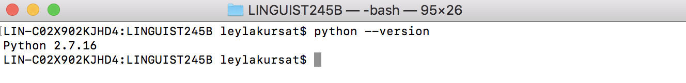
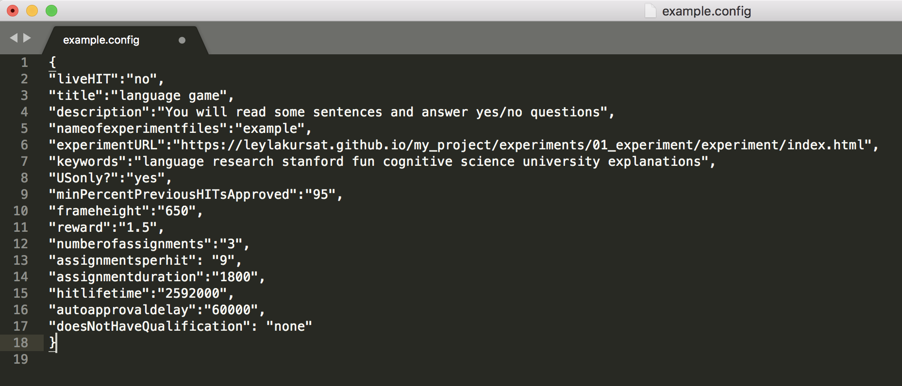
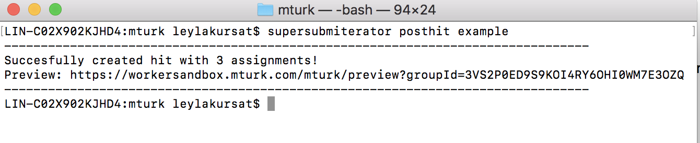
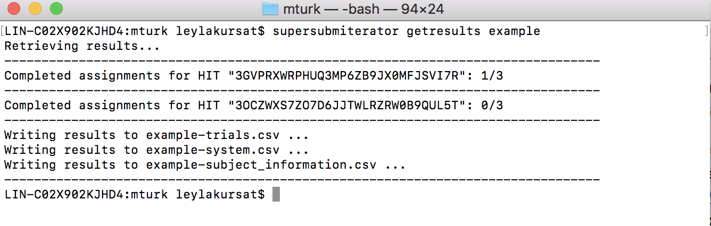
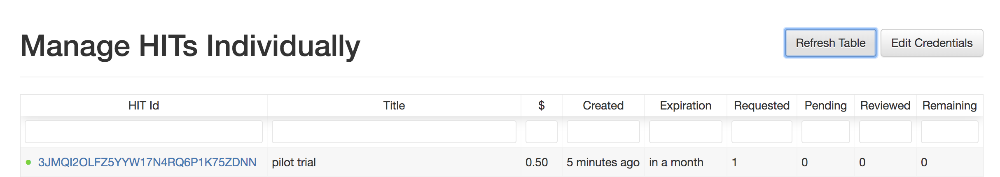

# Supersubmiterator Tutorial 

In this tutorial we will:

* put out experiment on the web
* clone supersubmiterator
* test our experiment in sandbox
* post our experiment as a HIT on Amazon Mechanical Turk and download results
* load the data into R

Before we start, make sure you have:

* an experiment coded in html/js in a folder organized like this repository <https://github.com/leylakursat/my_project>
* an MTurk requester account
* your access key/secret id saved

### **1. Hosting your experiment as a website on Github Pages**

1. Make sure you pushed all the changes to your remote repository (`my_project`).

2. Open `https://github.com/your_user_name/my_project` in your browser and click on Settings. Under GitHub Pages, change Source to `master branch` from `none`.

    

3. The page will automaticaly refresh and you will see a link to your site under GitHub Pages.

    

4. Open that link (<https://your_user_name.github.io/my_project/experiments/01_experiment/experiment/index.html>) with the correct path to your html file and your experiment should show up (sometimes it takes a few seconds!). 

### **2. Using supersubmiterator**

We use a tool called supersubmiterator to post experiments to Amazon Mechanical Turk. It's a python script written by Sebastian Schuster that streamlines the process of posting external HITs to MTurk and downloading data after participants do the experiment. 

1. From terminal, cd into your class folder `linguist245`

2. Execute `git clone https://github.com/sebschu/Submiterator.git`. Now you should have a folder called `Submiterator` and two files inside that folder (`example.config` and `supersubmiterator.py`).

3. Check if your default Python command is python2 or python3 by typing `python --version` in terminal.

    

4. If your default Python command is python2: 
    - Open `supersubmiterator.py` and change the first line to `#!/usr/bin/env python3`.

    
 
	- Install `boto3` and `xmltodict` packages by typing
	
	```
	pip3 install boto3
	pip3 install xmltodict
	```
	
5. If your default Python command is python3:
	- Install `boto3` and `xmltodict` packages by typing
	
	```
	pip install boto3
	pip install xmltodict
	```
	
6. Open your bash profile by typing `open ~/.bash_profile` (on most Macs) and add the two environment variables below with your MTurk access key and MTurk secret:

    ```
    export MTURK_ACCESS_KEY=<YOUR_MTURK_ACCESS KEY>
    export MTURK_SECRET=<YOUR_MTURK_SECRET>
    ```
    


### **3. Posting your webpage as a HIT**

1. Create a folder inside `my_project/experiments/01_experiment` and name it  `mturk`. This folder will contain all MTurk related files.

2. Make sure you have a `.gitignore` file in in the root directory of your project (`my_project`). `.gitignore` is a text file that tells Git which files or folders to ignore. We want to prevent the accidental uploading of confidential Worker IDs to the web so make sure this file includes `mturk/` and other confidential files. It's a hidden folder, to find it, open up `my_project` and press Command+Shift+Dot (on a Mac).

    

3. Copy and paste `example.config` and `supersubmiterator.py` files in my\_project/experiments/01_experiment/mturk

    

4. Before posting the experiment as a HIT we want to test it in sandbox. Open `example.config` in a text editor and edit each field for your purposes.
	- Make sure `liveHIT` is set to `no`
	- Add the `experimentURL` from above (<https://your_user_name.github.io/my_project/experiments/01_experiment/experiment/index.html>)
	- When calculating payment aim to pay at a rate of $12-14/hour
	- Change the title and write a short description for MTurkers to see
	
    You can find more information about each option at <https://github.com/sebschu/Submiterator>
    
    

5. Cd into `my_project/experiments/01_experiment/mturk` from terminal and type `python3 supersubmiterator.py posthit example` (or `python supersubmiterator.py posthit example` depending on which version of python you have)

    

6. Paste the outputted URL in your browser and complete the experiment. Time yourself to get an estimate for long the experiment takes.

7. When you're done, type `python3 supersubmiterator.py getresults example` in terminal while in the `mturk` folder.
 
    

8. Now you should have multiple files in the `mturk` folder. The data you want to analyze are in `example-subject_information.csv` and `example-trials.csv` files. Load the data into R and run your visualization/analysis code on the data to make sure you're recording everything you need. 

9. When you’re absolutely certain that your experiment runs and that you’re recording all the information you need for your analyses, load sufficient funds onto your MTurk requester account (remember there’s a 20% amazon fee). Open `example.config` and change `liveHIT` to `yes`. Make sure `numberofassignment` is set to the total number of participants you want to run.

10. In terminal, from your `mturk` folder type `python3 supersubmiterator.py posthit example`.

11. Open <https://manage-hits-individually.s3.amazonaws.com/v4.0/index.html#/credentials> in your browser and put in your MTurk access key and MTurk secret key and select `Production`. You can see how many people completed your experiment and kill your HIT from this link.
    
    

9. When all participants completed your experiment, run the getresults command (`python3 supersubmiterator.py getresults example`).

10. Copy and paste the `example-subject_information.csv` and `example-trials.csv` files in `my_project/analysis/01_experiment/data` because you want to be able to push these files to GitHub. 


### **3. Loading your data into R**

1. Open the `analysis.R` file in `my_project/analysis/01_experiment/rscripts`.

2.  Add these lines of code to your script and run them

    ```
    setwd(dirname(rstudioapi::getActiveDocumentContext()$path))    
    df = read.csv("../data/example-trials.csv", header = TRUE)
    View(df)
    ```


